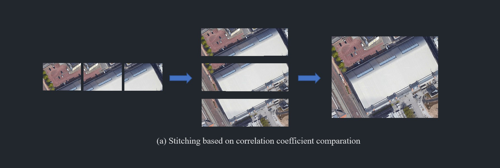
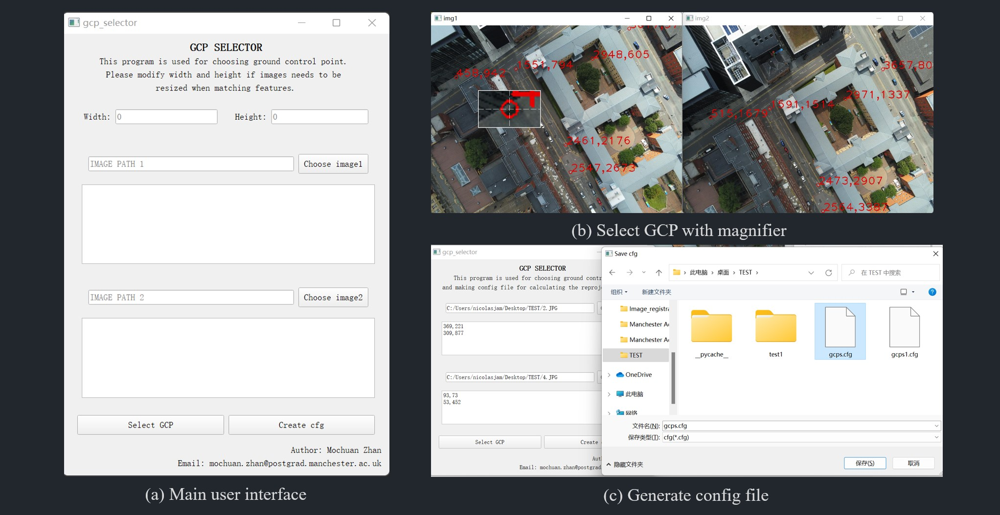

# MSDI_TOOL

## 1.Introduction

This is the util tools for Mochuan Zhan's MSC project: "Registration of UAV Imagery to Aerial and Satellite Imagery" at the University of Manchester (https://www.manchester.ac.uk/), supervised by Dr.Terence Patrick Morley.  

The basic idea of the project is to investigate various methods for the registration of downward-facing (nadir) drone imagery to higher altitude aerial and satellite imagery (Google, Bing), and possibly develop a system based on visual localization and navigation of drones (UAV) as opposed to using a satellite navigation system such as GPS. This project is based on the research of local feature detectors and high-throughput computing techniques.

This tool has four main functions:
* Automatic camera calibration and image undistortion (checkerboard image required).
* Obtaining corresponding Google/Bing satellite maps based on a batch of given images (GPS data required).
* Read/Copy/Delete/Modify EXIF data for a batch of images.
* A program with GUI used for annotating ground control points (GCPs) from both sensed image and reference image and auto-generate config file.

## 2.Dataset 
The dataset used in this project is MSDI (Manchester Surface Drone Imagery) which was collected and processed by Mochuan Zhan, supervised by Dr.Terence Patrick Morley.
The image dataset could be found throughing the DIO: or the Link:

The dataset contains 599 drone images of Manchester (447 downward facing, 89 45-degree forward facing, and 64 0-degree forward facing), 26 checkboard images taken by drone for camera calibration, camera internal parameter matrix and distortion matrix. 

The corresponding Google/Bing satellite maps could be obtained by this program. Because Google/Bing API only provides image of limited resolution (640x640 and 350x350 respectively), this program could be used to stitch several satellite maps together to obtain a higher resolution map (1550x1182 and 805x670 respectively). Due to the copyright issues, these image is not included in the dataset, but the user could apply their API KEY and obtain them, the following diagram demonstrates the principle of this process:




 
## 3.File Structure
```
# The complete file structure (now only have utils)
.
├── README.md
├── data                                # Image dataset 
│   ├── bing_advance_static_images      # Stitched Bing static map without watermark
│   ├── calibrated_images               # Calibrated drone images
│   ├── checkboard_images               # Checkboard images taken by drone
│   ├── google_advance_static_images    # Stitched Google static map without watermark
│   ├── google_static_images            # Google static map with watermark
│   ├── raw_images                      # Raw drone images
│   └── README.txt                      
├── model
│   ├── model_distortion.txt            # data for drone image distortion
│   └── model_matrix.txt                # Camera internal parameter matrix 
├── utils
│   ├── calibration.py                  # Class for camera calibration and image distortion
│   ├── config.py                       # configuration file for utils tools
│   ├── GCP_selector.py                 # Ground control point selector for calculating reprojection error in feature matching
│   ├── main.py                         # main function
│   ├── map.py                          # Class for requesting static map from Google/Bing and creating advance maps
│   └── myexif.py                       # Class for obtaining/copying/modifying images' exif data
└── requirements.py

```

## 4.GCP selector 
GCP selector is a tool for annotating ground control points in two images that need to be matched. By calculating the homography and projecting one image onto another, the average error of these GCPs could be calculated to represent the quality of the feature matching algorithm.



The user can choose to resize the first image and then select GCPs for two images simultaneously. To resize image is because the the registration between two images which have huge differences in the amount of data can be very difficult. Using GaussianBlur and Resize could reduce and summerize image information and obtain better matching results, if you choose to resize images before registration, please remember to input W and H to resize the image when selecting GCP.

This is how I choose the parameter of GaussianBlur: `KERNEL = (WIDTH_1 // WIDTH_2) ^ 2 # WIDTH_1 > WIDTH_2`

The following code is a sample GCP.cfg file:

```python
# SRC,im_name,name (im_num can be 1 or 2.)
SRC1,EV_001.JPG
SRC2,EV_002.JPG

# GCP,im_num,x,y (im_num can be 1 or 2.  Order of im2 GCPs must be the same as those for im1.)
GCP,1,370,218
GCP,1,359,968
GCP,1,683,615
GCP,2,329,191
GCP,2,299,1052
GCP,2,678,660
```

## 5.Run util tool
1. install Python 3.7 and required packages ` pip install -r requirements`
2. apply for Google/Bing Static Map API KEY (Google is not free, but a free trial could be used for a couple of month)
3. modify config.py
```python
# ==================== File Paths =================================================
# ADD ABSOLUTE PATHS FOR THE FOLLOWING FILE
CHECKER_BOARD_PATH = r'PATH'
RAW_IMAGE_FILE = r'PATH'
CALIBRATED_FILE = r'PATH'
GOOGLE_STATIC_MAP_FILE = r'PATH'
GOOGLE_ADVANCE_STATIC_MAP_FILE = r'PATH'
BING_ADVANCE_STATIC_MAP_FILE = r'PATH'

# ==================== Calibration model path =====================================
# ADD ABSOLUTE PATHS FOR THE FOLLOWING FILE
MODEL_NAME = r'PATH'

# ==================== API KEY FOR GOOGLE MAP =====================================
GOOGLE_API_KEY = "INPUT YOUR API KEY HERE"
GOOGLE_URL = "http://maps.googleapis.com/maps/api/staticmap?maptype=satellite"

# ==================== API KEY FOR BING MAP =======================================
BING_API_KEY = "INPUT YOUR API KEY HERE"
BING_URL = "https://dev.virtualearth.net/REST/v1/Imagery/Map/Aerial/"

# ==================== exif data that you want to input ===========================
ARTIST = 'MOCHUAN ZHAN'
COPYRIGHT = 'THE UNIVERSITY OF MANCHESTER'
USER_COMMENT = 'CALIBRATED'

```
4. Run main.py
```python
if __name__ == "__main__":

    print("add information to raw images!")
    modify_exif(CALIBRATED_FILE, {'artist': ARTIST, 'copyright': COPYRIGHT, 'user_comment': 'RAW IMAGE'})
    
    calib = Calibration()
    print("start create calibrate model!")
    calib.create_model(WIDTH, HEIGHT, CHECKER_BOARD_PATH) 

    print("start undistort!")
    calib.undistort(RAW_IMAGE_FILE, CALIBRATED_FILE)

    
    print("copy exif to calibrated images!")
    copy_exif(RAW_IMAGE_FILE, CALIBRATED_FILE)
    modify_exif(CALIBRATED_FILE, {'artist': ARTIST, 'copyright': COPYRIGHT, 'user_comment': USER_COMMENT})
    

    print("get static google map!")
    map = Map(CALIBRATED_FILE, GOOGLE_STATIC_MAP_FILE)
    map.get_maps(advance=0)

    print("get advance static google map")
    ad_map = Map(CALIBRATED_FILE, GOOGLE_ADVANCE_STATIC_MAP_FILE, 'google')
    ad_map.get_maps(advance=1)

    print("get advance static bing map")
    ad_map = Map(CALIBRATED_FILE, BING_ADVANCE_STATIC_MAP_FILE, 'bing')
    ad_map.get_maps(advance=1)
```

